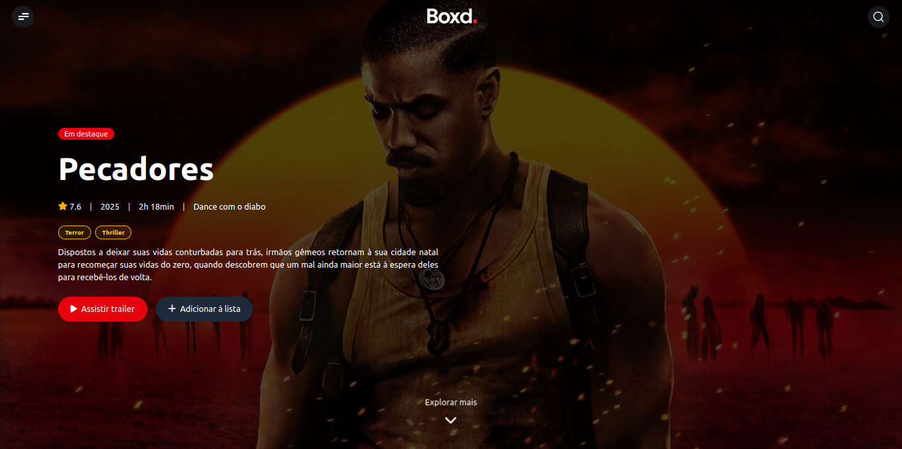
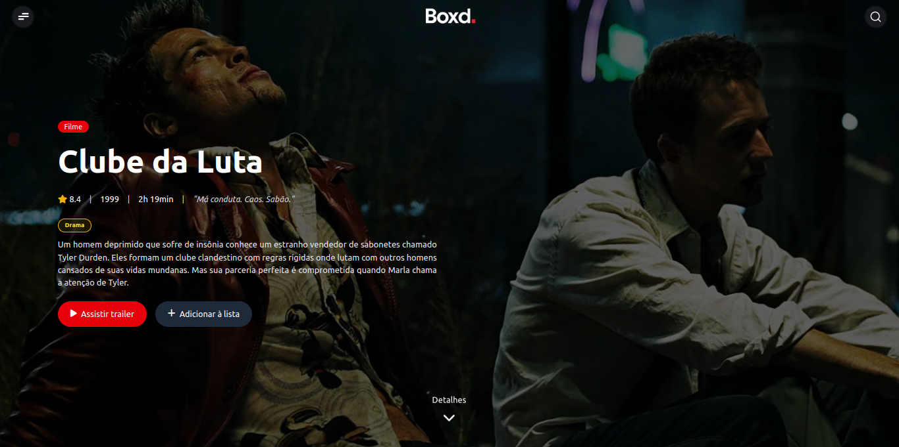
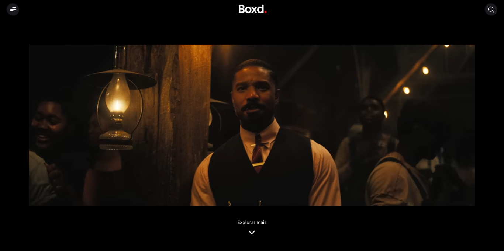

<h1 align=""> Boxd </h1>


**Boxd** é uma plataforma web inspirada em serviços como *Letterboxd*, que permite aos usuários explorarem, pesquisarem e descobrirem filmes, séries e pessoas do universo do cinema. Tudo isso com um visual moderno, recursos de busca instantânea e integração com a **API do TMDB**.

---

## ✨ Funcionalidades

- 🔎 **Busca inteligente** por filmes, séries e pessoas (com debounce e sugestões dinâmicas)
- 🎥 **Assistir trailers** em tela cheia sem distrações
- 🎬 Página de **detalhes com capa, sinopse, nota, gêneros e duração**
- 🌟 Seção de **filmes populares da semana**
- 💨 Skeleton Loading (efeito de carregamento com `animate-pulse`)
- ⚡ Integração com a [The Movie Database API (TMDB)](https://www.themoviedb.org/)
- 📱 Design responsivo com **Tailwind CSS**
- 🚀 Backend com **Express.js + EJS**

---

## 🧠 Tecnologias usadas

| Stack       | Tecnologias |
|-------------|-------------|
| **Frontend** | HTML5, TailwindCSS, JavaScript, Typescript, EJS |
| **Backend** | Node.js, Express.js, Express EJS Layouts |
| **API**     | TMDB (The Movie Database API) |
| **Extras**  | Font Awesome, animações CSS, debounce de input |

---
## 📸 Capturas de Tela

<p align="center">
  
    &nbsp;&nbsp;&nbsp;
  
    &nbsp;&nbsp;&nbsp;
  
</p>

## ⚙️ Como rodar localmente

```bash
# Clone o projeto
git clone https://github.com/oBrunoz/boxd.git
cd boxd

# Instale as dependências
npm install

# Crie um arquivo .env com sua chave TMDB
touch .env
```

**.env**
```
TMDB_API_KEY=sua_chave_aqui
PORT=3000
```

```bash
# Rode o servidor
npm start
```

Acesse: [http://localhost:3000](http://localhost:3000)

---

## 🗂️ To-do (próximas melhorias)

- [ ] Sistema de autenticação (login/cadastro)
- [ ] Criação de listas personalizadas
- [ ] Avaliações de filmes
- [ ] Página de pessoa (atores/diretores)
- [ ] Suporte a favoritos
